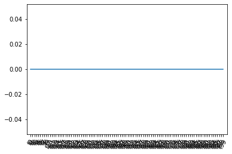
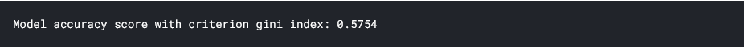
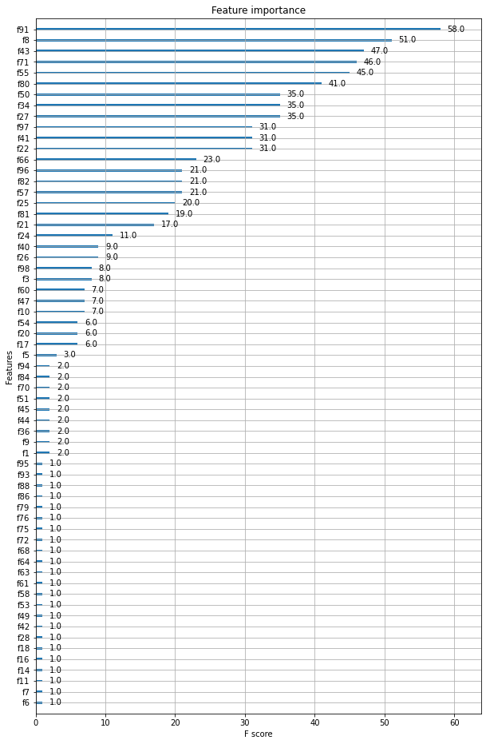
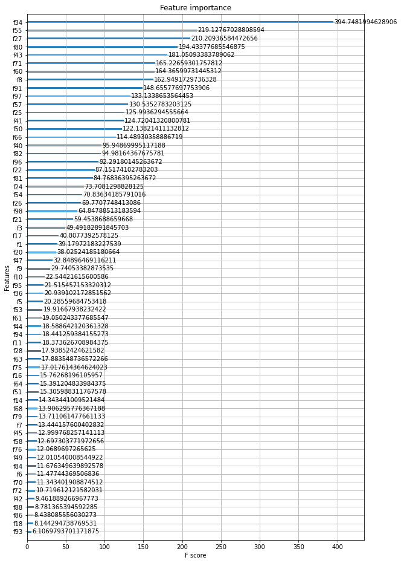
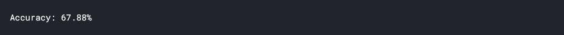
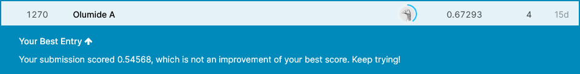

# November 2021 Tabular Playground Series

This repository contains the code for submissions to train the model presented in the [Kaggle Competition](https://www.kaggle.com/c/tabular-playground-series-nov-2021)

It is a presentation repository for my submissions to the November Kaggle competition.

### Load packages
```
# Load packages
import matplotlib.pyplot as plt
from sklearn.model_selection import train_test_split
from sklearn.preprocessing import StandardScaler, OrdinalEncoder
from sklearn.tree import DecisionTreeClassifier
from sklearn.metrics import accuracy_score
from sklearn import tree
```
### Load Training Data
```
# Load training data
df = pd.read_csv("../input/tabular-playground-series-nov-2021/train.csv") 
# check for missing values
#df.isnull().sum()
df.head()
```

### Split into predictor and target variables
```
#Split the data into X and y
output_col = ['target']
X = df.drop(['id', 'target'], axis=1)
y = df[output_col]
```

### Using L1 Regression to differentiate between important variables
```
# Lasso (L1) Regression: Plot is flat 
from sklearn.linear_model import Lasso

df_columns = X.columns

# Instantiate a lasso regressor: lasso
lasso = Lasso(alpha=0.4, normalize=True)

# Fit the regressor to the data
lasso.fit(X,y)

# Compute and print the coefficients
lasso_coef = lasso.fit(X,y).coef_
print(lasso_coef)

# Plot the coefficients
plt.plot(range(len(df_columns)), lasso_coef)
plt.xticks(range(len(df_columns)), df_columns.values, rotation=60)
plt.margins(0.02)
plt.show()
```


```
# Split the data into training and test data
X_train, X_test, y_train, y_test =  train_test_split(X,y,test_size = 0.30, random_state= 44)

# Choose the criterion and max depth of the tree you want to use
CRITERION = 'gini'
MAX_DEPTH = 3

# Set up the DT classifier
dt_clf = DecisionTreeClassifier(criterion=CRITERION, max_depth=MAX_DEPTH, random_state=43)

# Train the DT classifier
dt_clf.fit(X_train, y_train)

# Evaluate the DT on the test set
y_pred = dt_clf.predict(X_test)
print(f'Model accuracy score with criterion {CRITERION} index: {accuracy_score(y_test, y_pred):.4f}')
```


### XGBoost
```
import xgboost as xgb # XGBoost typically uses the alias "xgb"

# Instatiate a XGBClassifier 
xgb_clf = xgb.XGBClassifier(n_estimators= 12, random_state=43, eval_metric='mlogloss')

# Inspect the parameters
#xgb_clf.get_params()

# make predictions for test data
xgb_clf.fit(X_train, y_train)

# Evaluate the DT on the test set
y_pred_xg = xgb_clf.predict(X_test)

# evaluate predictions
accuracy = accuracy_score(y_test, y_pred_xg)
print("Accuracy: %.2f%%" % (accuracy * 100))
# print("Baseline accuracy:", accuracy)
```

###feature Importance and Gain
```
# Checking feature importance
import matplotlib
matplotlib.rcParams['figure.figsize'] = (10.0, 16)

# Plot feature importance
xgb.plot_importance(xgb_clf)
```

```
# Plot gain instead of weight
xgb.plot_importance(xgb_clf, importance_type="gain")
```


### RandomSearch Cross Validation
I commented out this in the final submission because it took too much processing time
```
# RandomSearch CV

#from sklearn.model_selection import RandomizedSearchCV

# Define a parameter grid
rs_param_grid = {
    # max_depth: values from 3 to 12
    'max_depth': list((range(3,12))),
    # alpha: values 0, .001, .01, .1
    'alpha': [0,0.001, 0.01,0.1,1],
    # subsample: values 0.25,0.5,0.75, 1
    'subsample': [0.5,0.75,1],
    # learning rate: ten values between 0.01 - 0.5
    'learning_rate': np.linspace(0.01,0.5, 10),
    # n_estimators: values 10, 25, 40
    'n_estimators': [10, 25, 40]
    }


# Insantiate XGBoost Clasifier 
xgb_clf_rs = xgb.XGBClassifier(eval_metric='mlogloss', random_state=43)

# Instantiate RandomizedSearchCV()
xgb_rs = RandomizedSearchCV(estimator=xgb_clf_rs,param_distributions=rs_param_grid, 
                                cv=3, n_iter=5, verbose=2, random_state=43)

# Train the model on the training set
xgb_rs.fit(X_train, y_train)

# Print the best parameters and highest accuracy
print("Best parameters found: ", xgb_rs.best_params_)
print("Best accuracy found: ", xgb_rs.best_score_)
```
### Final Model based on RandomCV
```
#instantiate final model
final_xgb_clf = xgb.XGBClassifier(eval_metric='mlogloss', random_state=43, 
                               subsample= 1, n_estimators= 40, max_depth= 6,
                               learning_rate= 0.44555555555555554, alpha= 0.01)
# make predictions for test data
final_xgb_clf.fit(X_train, y_train)

# Evaluate the DT on the test set
y_pred_xg_final = final_xgb_clf.predict(X_test)

# evaluate predictions
accuracy = accuracy_score(y_test, y_pred_xg_final)
print("Accuracy: %.2f%%" % (accuracy * 100))
```


### Best Score but not Final score
Tried Scaling data which gave a better score but overfit the model to the training set and reduced potential for generalization.


### Version submissions
[Best version: submission v011](https://www.kaggle.com/olumoni/nov-tabplayground?scriptVersionId=79984986)

[Last version: submission v015](https://www.kaggle.com/olumoni/nov-tabplayground/notebook)
